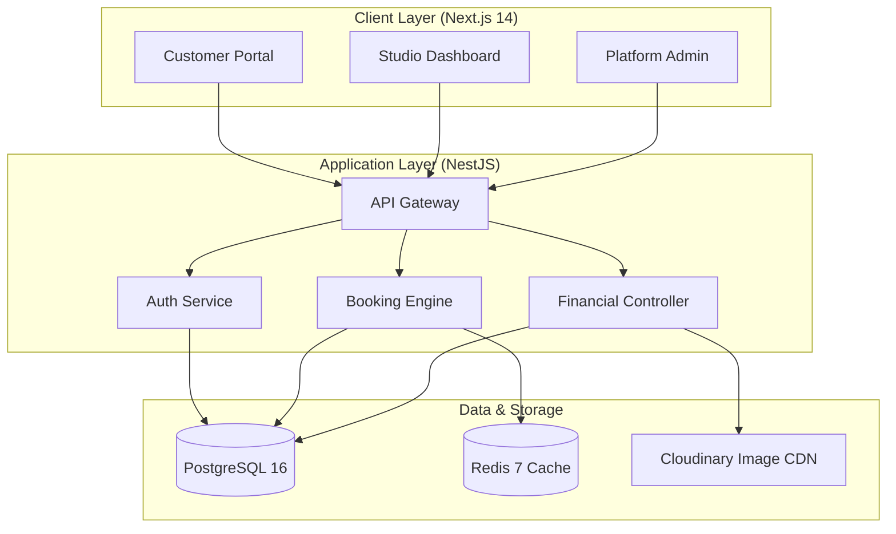

<p align="center">
  
</p>

<h1 align="center">PhotoStudio SaaS</h1>

<p align="center">
  <strong>The Enterprise-Grade Operating System for Modern Photography Studios.</strong>
</p>

<p align="center">
  
  
  
</p>

---

## 🌟 Vision

PhotoStudio SaaS is not just a tool; it's a comprehensive **Multi-Tenant Infrastructure** designed to scale with your studio. From solopreneurs to enterprise-level photography firms, our platform provides a unified workspace to manage bookings, clients, portfolios, and finances with surgical precision.

---

## 🏗 System Architecture

The platform is engineered using a modular **Monorepo Architecture**, ensuring high cohesion and low coupling across the stack.



---

## ✨ Core Modules

### 🛡 Multi-Tenancy & Security
*   **Logical Isolation**: Strict studio-level data partitioning.
*   **Role Hierarchy**: Owner, Photographer, and Assistant roles with fine-grained RBAC.
*   **JWT Ecosystem**: Dual-token strategy with short-lived access and 7-day refresh cycles.

### 📅 Booking Intelligence
*   **Workflow Automation**: Transitions from `INQUIRY` → `QUOTED` → `CONFIRMED` → `COMPLETED`.
*   **Clash Prevention**: Native support for availability checks and conflict detection.
*   **Photographer Routing**: Efficiently assign and manage staff for every session.

### 💳 Financial Operations
*   **Automated Invoicing**: Professional PDF generation using Headless Puppeteer.
*   **Omnichannel Payments**: Integrated tracking for UPI, Bank Transfer, and Card.
*   **Analytics Pod**: Real-time revenue, LTV, and studio performance metrics.

---

## 🛠 Tech Stack

| Tier | Technologies |
| :--- | :--- |
| **Frontend** | Next.js 14 (App Router), Tailwind CSS, Zustand, Axios |
| **Backend** | NestJS 11, Prisma ORM, JWT, class-validator |
| **Infrastructure** | Docker, PostgreSQL 16, Redis 7, Headless Chrome |
| **Cloud Services** | Cloudinary (Files), Resend (Transactional Email) |

---

## 🚀 Deployment Deep-Dive

### 1. Zero-Conf Docker Setup (Recommended)
```bash
# Clone the repository
git clone https://github.com/ak-bharadwaj/photostudio-saas.git

# Spin up the infrastructure
docker-compose up -d

# Install & Initialize
pnpm install
pnpm exec turbo run build
```

### 2. Manual Configuration
1.  **Environment Setup**: Clone `.env.example` in both `apps/backend` and `apps/frontend`.
2.  **Prisma Initialization**:
    ```bash
    pnpm prisma:generate
    pnpm prisma:migrate
    pnpm prisma:seed
    ```
3.  **Start Services**: `pnpm dev` from the root.

---

## 🌐 API Reference (V1)

| Endpoint | Method | Role | Description |
| :--- | :--- | :--- | :--- |
| `/auth/login` | POST | Public | Authenticate and retrieve tokens |
| `/bookings` | GET | Studio | List all bookings with filters |
| `/invoices/:id/pdf` | GET | Studio | Stream professional PDF invoice |
| `/public/studios/:slug` | GET | Public | Fetch public studio configuration |

---

## 🔒 Security Compliance

*   **Data Encryption**: All PII is encrypted at rest and TLS 1.3 in transit.
*   **Isolated Sessions**: Studio owners cannot view data from other tenants under any condition.
*   **CSRF/XSS Mitigation**: Strict sanitization and httpOnly cookie storage.

---

## 🗺 Future-Proofing (Roadmap)

- [ ] **Phase 3**: Native iOS/Android App via Capacitor.
- [ ] **Phase 4**: AI-Powered Image Auto-Tagging & Culling.
- [ ] **Phase 5**: WhatsApp Business API Integration for instant alerts.

---

<div align="center">
  <p>Built for the next generation of visual storytellers.</p>
  <p>Proprietary License © 2026 PhotoStudio SaaS Team</p>
</div>
